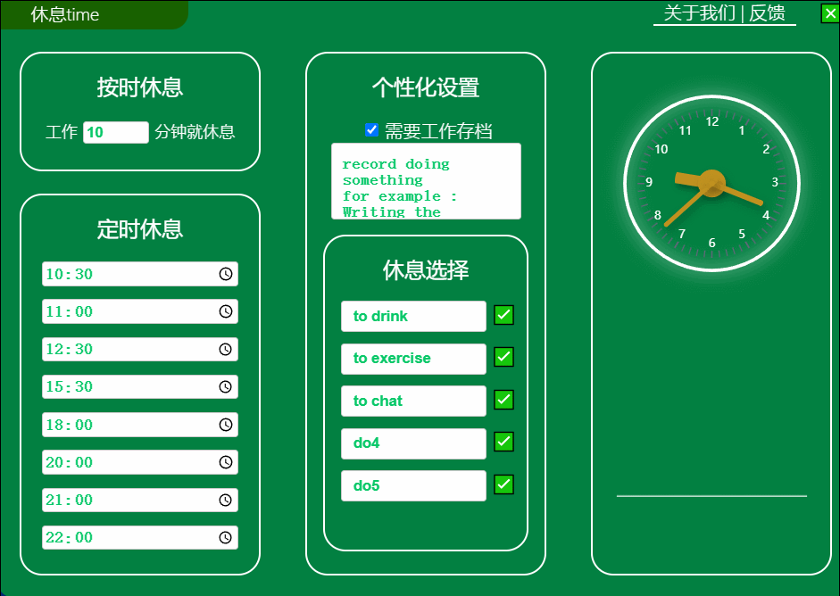

# 软件工程项目：智慧休息/休息助手

GitHub 仓库：[https://github.com/okkjoo/wisely_relax](https://github.com/okkjoo/wisely_relax)

# 技术栈

- React + TypeScript
- SCSS
- electron
  - electron-vite-react

# 运行

```
// 安装依赖
npm install
// 开发环境
npm run dev
// 编译
npm run build
```

# 效果


更多效果查看：[UI 文档](https://www.yuque.com/qzhou/learning/gvezl557mhckmbco?singleDoc#%20%E3%80%8A%E6%99%BA%E6%85%A7%E4%BC%91%E6%81%AFUI%20%E7%AE%80%E5%8D%95%E8%AE%BE%E8%AE%A1%E3%80%81%E5%AE%9E%E7%8E%B0%E6%95%88%E6%9E%9C%E3%80%8B)

# git commit 简单约束

- 『feat』: 新增功能
- 『fix』: 修复 bug
- 『docs』: 仅仅修改了文档，比如 README, CHANGELOG 等等
- 『test』: 增加/修改测试用例，包括单元测试、集成测试等
- 『style』: 修改了空行、缩进格式、引用包排序等等（不改变代码逻辑）
- 『perf』: 优化相关内容，比如提升性能、体验、算法等
- 『refactor』: 代码重构，「没有新功能或者 bug 修复」
- 『chore』: 改变构建流程、或者增加依赖库、工具等
- 『revert』: 回滚到上一个版本
- 『merge』: 代码合并

# 目录

```
├── electron                  Electron-related code
│   ├── main                  Main-process source code
│   ├── preload               Preload-scripts source code
│   └── resources             Resources for the production build
│       ├── icon.icns             Icon for the application on macOS
│       ├── icon.ico              Icon for the application
│       ├── installerIcon.ico     Icon for the application installer
│       ├── uninstallerIcon.ico   Icon for the application uninstaller
|       └── iconset
|           └── 256x256.png       Icon for the application on Linux
│
├── release                   Generated after production build, contains executables
│   └── {version}
│       ├── {os}-unpacked     Contains unpacked application executable
│       └── Setup.{ext}       Installer for the application
│
├── public                    Static assets
└── src                       Renderer source code, your React application
```
